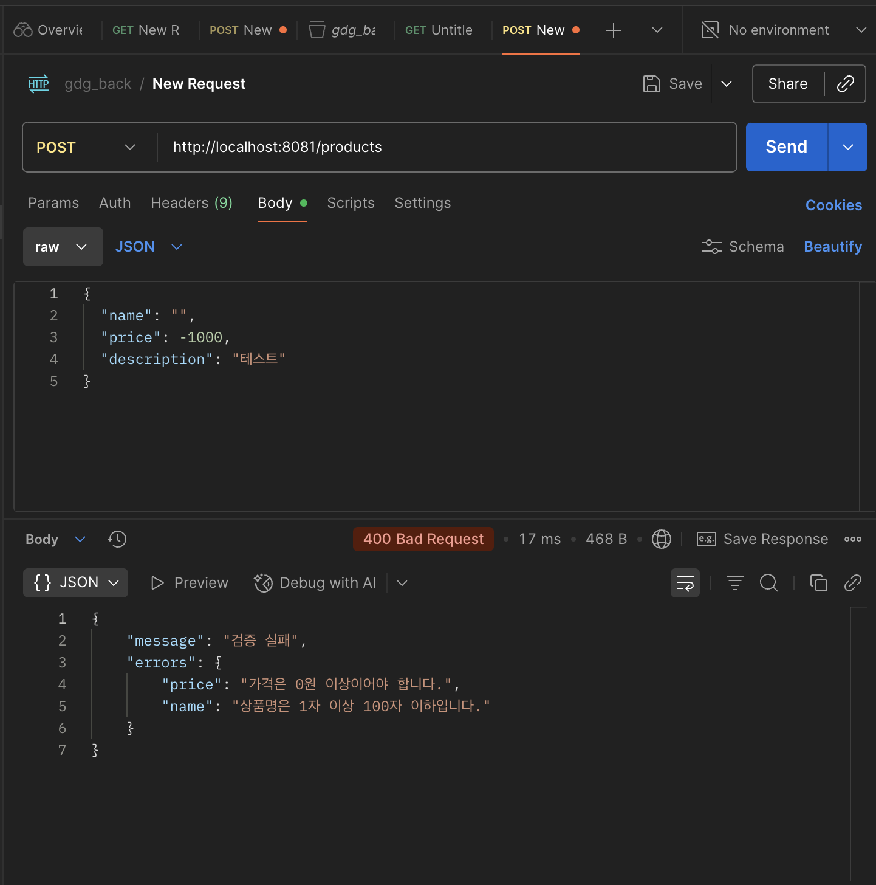
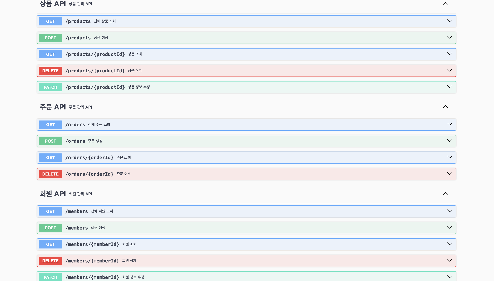

유효성검사
스프링은 dto에서 유효성검사를 한다.

- 유혀성 검사 어노테이션 적용 @notnull, @size, @pattern 등
- controller 메서드에 @Valid

예외처리

1. global Exception Handler
   공통 예외처리 핸들러
   에러 정보 반환용 dto
   AOP(관점 지향 프로그래밍): 부가 기능을 모듈화, 여러 클래스에 걸쳐 반복되는 공통 기능을 분리한다.
2. 커스텀 예외 처리
   에러 원인을 명활히 알 수 있다.

3. 에러 메세지 클래스

API 문서화
클라이언트와 소통 시 필요하다.
그 중 하나인 swgger을 사용한다.
spring doc을 사용한다.
@Tag: api 그룹화(컨트롤러 레벨)
@operation: api요약과 설명(메서드 레벨)
@ApiResponse: 단일응답코드설명(메서드 레벨)

